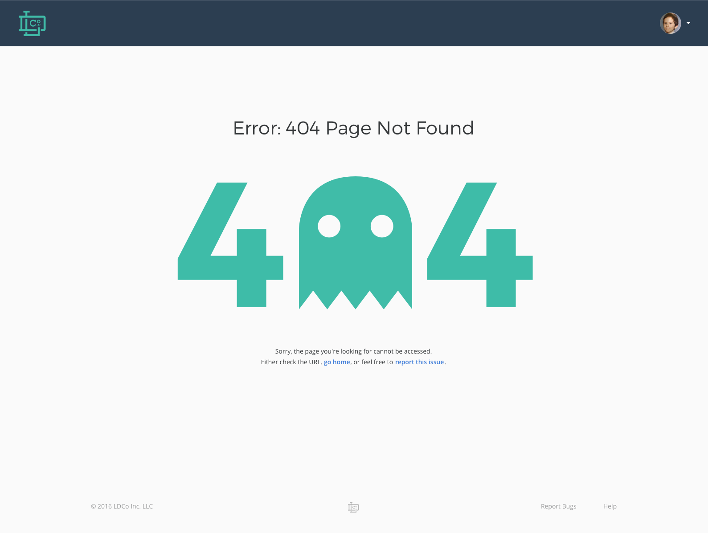

# Имя
Выберите самообъясняющееся название для своего проекта.

## Описание
В **данном** _репозитории_ исходный код
Ссылка на страницу разработки [GitHub](https://gitlab.rebrainme.com/devops_users_repos/2844/rebrain-devops-task1.git)


## Установка
1. Item 1
1. Item 2
1. Item 3
   1. Item 3a
   1. Item 3b

## Примеры использование 

Запуск основных сервисов

```
systemctl start nginx

```

После запуска вам будет доступна главная страница



## Дорожная карта
Если у вас есть идеи для выпусков в будущем, рекомендуется перечислить их в README.
- [x] Basic. Git
- [ ] Terraform
- [ ] Ansible
- [ ] Vagrant
- [ ] Development
- [ ] QA
- [ ] CI / CD

## Сообщество и поддержка
Раздел находится в разработке

## Участие в проекте
Просмотрите существующие [проблемы](https://github.com/nedr17/rebrain-devops-task1/issues) и [запросы](https://github.com/nedr17/rebrain-devops-task1/pulls) на извлечение, с которыми вы могли бы помочь. Если вы хотите запросить функцию или сообщить об ошибке, создайте проблему GitHub с помощью одного из предоставленных [шаблонов](https://github.com/nedr17/rebrain-devops-task1/issues).

## Лицензия
Distributed under the MIT License. See LICENSE for more information.

## Статус проекта
Проект находится в разработке

## Контактная информация
Раздел находится в разработке